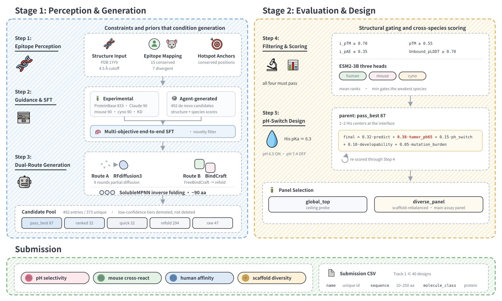

# High-Affinity, pH-Selective EGFR Binder Design: Technical Route and Screening Report

---

## 1. Objectives and Design Principles

The goal is to design high-affinity binders against EGFR, ranked by the following priorities:

| Priority | Objective | Criterion |
|---|---|---|
| **P1** | **pH selectivity** | binds human EGFR at pH 6.5, no detectable binding at pH 7.4 |
| **P2** | **mouse cross-reactivity** | the same sequence also binds mouse EGFR, enabling later mouse-model validation |
| **P3** | **human EGFR affinity** | the stronger the better, ranked below the two above |

---

## 2. Technical Route



*Figure 1　Two-stage workflow. Stage 1 derives hotspot constraints from the target structure and generates de novo backbones along two parallel routes; Stage 2 applies multi-model structural filtering and three-species KD scoring, then pH post-design, emitting two candidate pools.*

The route is a closed loop of epitope analysis → data scoring and guidance → generation → structural filtering → KD scoring → pH post-design → panel selection. Human/mouse conserved epitopes serve as hotspot constraints, and the A5 scorer is run over the existing EGFR data to extract statistics that bias generation; RFdiffusion3 and BindCraft run in parallel to produce ~90 aa mini-binders; candidates pass multi-model structural filtering and ESM2-3B three-species scoring before being tiered into the pool; His centres are then placed at the interface in pH post-design, and every new sequence is re-scored for structure and cross-species probability. The loop converges on candidates combining pH selectivity, mouse cross-reactivity and high affinity.

Execution units, referenced by code below:

| Code | Stage | Section |
|---|---|---|
| A1 | epitope analysis | §3 |
| A5 | scoring existing data into a guidance set | §4 |
| A2 | dual-route generation | §5.1 |
| A3 | candidate-pool maintenance | §5.3 |
| A4 | multi-model structural filtering | §6.1 |
| A5 | three-species KD scoring | §6.2 |
| A6 | pH post-design | §6.3 |
| A7 | panel selection and submission | §7.2 / §8 |

Two workflow-level constraints: the generating units (A2, A6) are separate from the rejecting units (A4, A5), and A4's thresholds are neither visible nor adjustable to A2; low-confidence candidates are demoted rather than deleted, preserving traceable re-entry.

<details>
<summary>Text version of the flow diagram</summary>

```
  EGFR target data (human / mouse / cyno)
        ↓
  A1 epitope analysis: conserved + divergent epitopes → hotspot constraints
        ↓
  A5 data scoring:  existing EGFR data → three-species scores → guidance priors
                    (residue bias / length · charge / liability)
        ↓
  A2 generation ──┬── Route A  RFdiffusion3 → SolubleMPNN → 9 rounds partial diffusion
                  └── Route B  BindCraft / FreeBindCraft → SolubleMPNN → refold
        ↓
  A4 multi-model structural filtering  i_pTM / pTM / i_pAE / Unbound_pLDDT
        ↓
  A5 KD predictor  ESM2-3B + three-species heads
        ↓   ⟲ A6 output re-scored through A4 / A5
  A6 pH post-design: interface His centres + pH 6.5 composite ranking
        ↓
  A7 panel selection: global_top + diverse_panel → submission CSV
```

</details>

---

## 3. Design Basis: EGFR Epitope Analysis

Contact epitopes between the cetuximab-like antibody and human EGFR were defined from the 1YY9 structure (EGFR chain A; Fab light / heavy chains C/D; 4.5 Å atomic contact cutoff), then mapped onto mouse EGFR to separate conserved from divergent epitopes:

| Epitope type | Positions | Design implication |
|---|---|---|
| conserved (shared human / mouse) | 373, 406, 408, 432, 433, 435, 436, 439, 441, 462, 464, 465, 489, 490, 493 | fixed as anchors, preserving the original binding mode |
| divergent (human / mouse differ) | 377 R/K, 442 S/G, 467 K/R, 491 I/M, 492 S/N, 495 G/A, 497 N/K | side chains take small or polar residues compatible with both species |

Sources: PDB 1YY9 + UniProt human EGFR P00533 / mouse EGFR Q01279 | Criterion: 4.5 Å atomic contact cutoff

Hotspots are drawn mainly from conserved epitopes, so that P2 (cross-species binding) is constrained structurally at generation time rather than filtered for afterwards.

---

## 4. Data Scoring and Generation Guidance

The existing EGFR data had so far only been used to train the KD predictor. This step turns the A5 scorer back onto that data and converts the resulting scores into constraints handed down to generation.

**Input**: human 923 records (Claude 90 + ProteinBase EGFR 833), mouse 90, cyno 90.

**Steps**:

1. Re-score all existing records with the ESM2-3B three-species heads, giving per-record species probabilities and a cross-species composite
2. Keep records with a high human probability whose `cross_species_min_prob` does not collapse, forming a high-quality positive set
3. Extract **statistics** from that positive set: residue preference at interface positions, length distribution, net-charge and hydrophobicity windows, developability liability frequencies
4. Hand those statistics to A2 as generation constraints: position-specific amino-acid bias for SolubleMPNN, plus a fast post-generation pre-filter on length, net charge and liabilities
5. Use the same positive set to calibrate the scorer: compare the score distribution of de novo candidates against known positives to detect extrapolation drift on the de novo sequence distribution

**Compliance boundary**: only distribution-level statistics and biases are passed down. No sequence, fragment or motif from an existing binder may seed generation, and no sequence in the guidance set enters the candidate pool or the submission.

**Outputs**: `gene_data/guidance_set.csv` (the scored table of existing data) and `gene_data/guidance_priors.json` (position biases and pre-filter thresholds).

---

## 5. Candidate Generation

### 5.1 De Novo Mini-Binder Generation (Dual Route)

Roughly 90 aa mini-binders are generated de novo against EGFR along two complementary routes, run in parallel without filtering each other:

| Route | Pipeline | Current output |
|---|---|---|
| **Route A: RFdiffusion3** | RFdiffusion3 backbone → SolubleMPNN → 9 rounds partial diffusion → multi-model filtering | quick screen, 32 designs (no structural metrics yet) |
| **Route B: BindCraft** | FreeBindCraft / BindCraft → SolubleMPNN or co-design → refold / structural filtering / ranked | 87 structure-pass, 32 rank candidates |

Inverse folding uses SolubleMPNN throughout.

### 5.2 Candidate Summary

Candidates are collected in `gene_data/biogen.csv`: **492 records (373 unique sequences)**, tiered by how directly they can be acted on:

| Tier | Rank range | Count |
|---|---|---|
| `structure_pass_best` | 1–87 | 87 |
| `bindcraft_ranked` | 88–119 | 32 |
| `rf_sequence_quick_screen` | 120–151 | 32 |
| `refold_source_trace` | 152–445 | 294 |
| `raw_trajectory_trace` | 446–492 | 47 |

### 5.3 Candidate-Pool Maintenance

Low-confidence tiers are demoted, never deleted. If pH post-design finds a scaffold family more amenable to switching, related candidates can be pulled back from the trace tiers and put through structural filtering.

---

## 6. Scoring and Screening

### 6.1 Multi-Model Structural Filtering

Structural thresholds (BindCraft convention); all must be met for `structure_pass`:

| Metric | Threshold | What it measures |
|---|---|---|
| i_pTM | ≥ 0.70 | interface confidence |
| pTM | ≥ 0.55 | overall fold confidence |
| i_pAE | ≤ 0.35 | interface positional error |
| Unbound_Binder_pLDDT | ≥ 0.70 | fold confidence of the binder without its target |

The first three measure the complex's interface and fold confidence; `Unbound_Binder_pLDDT` measures the binder's fold confidence in the absence of the target. The two differ in input conditions.

### 6.2 Three-Species KD Predictor

Architecture: frozen protein-encoder embeddings → shared MLP → human / mouse / cyno heads, sharing the encoder and trunk while splitting the prediction head per species. The encoder is **ESM2-3B** (frozen).

**Ranking signals**:

- Primary: `cross_species_mean_prob` (mean probability across the three species)
- Secondary: `cross_species_min_prob` (weakest-species protection, guarding against collapse on any one species)

For P2, `cross_species_min_prob` acts as a gate rather than a ranking term alone: a candidate with a low mouse probability is demoted even if its mean is high.

**Training data distribution**:

| Species | Distribution | Source |
|---|---|---|
| Human | 923 usable records | Claude 90 + ProteinBase EGFR 833 |
| Mouse | binder 17 / non_binder 67 / not_tested 6 | Claude data only |
| Cyno | binder 10 / non_binder 74 / not_tested 6 | Claude data only |

The mouse and cyno heads are each trained on roughly 90 records with fewer than 20 positives, so their predictions are less reliable than the human head. P2 judgements must be cross-checked against conserved-epitope coverage (§3) rather than resting on this score alone.

### 6.3 pH Post-Design

**Principle**: the histidine side chain has pK<sub>a</sub> ≈ 6.0–6.5 — partially protonated and positively charged at pH 6.5, deprotonated and neutral at pH 7.4. Placing His at the interface makes binding depend on its protonation state, giving a pH ON/OFF switch.

**Steps** (parents restricted to the de novo candidates of §5):

1. Select parents — all candidates in the `structure_pass_best` tier (rank 1–87)
2. Locate mutable positions — interface contact residues, excluding anchor positions that hydrogen-bond or salt-bridge to conserved epitopes
3. His enrichment — place 1–2 His centres per parent at interface positions, enumerate combinations, deduplicate
4. Re-score — pass every new sequence through §6.1 and §6.2 again; parent scores are not carried over
5. Composite ranking (each term converted to a percentile, then weighted):

```
final_score = 0.32 × predict          # affinity anchor
            + 0.38 × tumor_ph65       # pH 6.5 ON / pH 7.4 OFF switch strength
            + 0.15 × ph_switch        # overall pH sensitivity
            + 0.10 × developability   # developability
            + 0.05 × mutation_burden  # penalty on edit count
```

The pH term outweighs the affinity term, matching P1 > P3; `predict` is retained as an anchor because introducing His usually lowers affinity, a cost the switch gain has to offset.

---

## 7. Current Results and Candidate Pools

### 7.1 Leading De Novo Candidate

The most directly actionable tier is FreeBindCraft's `structure_pass_best`; the leading design is `egfr_bindcraft2_denovo_l97_7af9932070160527_candidate2` (selection_rank 1):

| Item | Value |
|---|---|
| Three-species probability | human 0.995 / mouse 0.754 / cyno 0.995, mean 0.915 |
| Structural metrics | i_pTM 0.90, pTM 0.92, i_pAE 0.12, Unbound_Binder_pLDDT 0.96 |

It meets both the structural and the three-species criteria. The RFdiffusion3 partial route has only completed a quick screen; refold and structural filtering come next.

### 7.2 Panel Selection

| Pool | Composition | Purpose |
|---|---|---|
| `global_top` | top N by composite score | scaffold-concentrated, probes the ceiling |
| `diverse_panel` | rebalanced across generation routes and backbone scaffolds | main body of the first assay panel, lowering whole-panel failure risk |

**First assay panel, suggested counts**: diverse_panel 60–80, global_top 20–40, high-affinity controls without pH design 8–12.

---

## 8. Submission

**Required CSV**:

| Column | Value |
|---|---|
| `name` | = `candidate_id` |
| `sequence` | = `seq` (10–250 aa) |
| `molecule_class` | `protein` |

**Ordering strategy**:

1. Highest pH-switch scores within `diverse_panel`
2. High scorers from `global_top`
3. Candidates with high `cross_species_min_prob`
